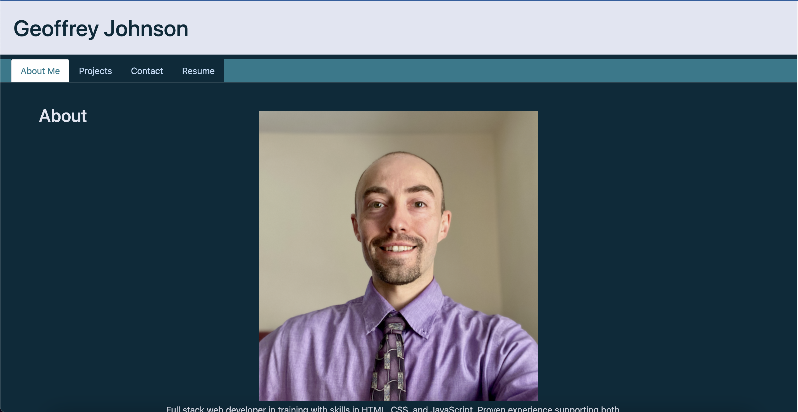

# React Portfolio App
Web portfolio created by Geoff Johnson.

## Table of Contents
* [Description](#description)
* [Screenshot](#screenshot)
* [Link](#link)
* [Available-Scripts](#available-scripts)
* [Code](#code)
* [Contact](#contact)
* [Technologies](#technologies)
* [Project Status](#project-status)

## Description 
Portfolio of web development projects and information about me, Geoff Johnson

## Screenshot

## Available Scripts
In the project directory, you can run:

### `npm start`

Runs the app in the development mode.\
Open [http://localhost:3000](http://localhost:3000) to view it in your browser.

The page will reload when you make changes.\
You may also see any lint errors in the console.

### `npm run build`

Builds the app for production to the `build` folder.\
It correctly bundles React in production mode and optimizes the build for the best performance.

The build is minified and the filenames include the hashes.\
Your app is ready to be deployed!

See the section about [deployment](https://facebook.github.io/create-react-app/docs/deployment) for more information.

## Link
[React Portfolio Website](https://johny49.github.io/react-portfolio/)

## Code
[GitHub Code Repository](https://github.com/Johny49/react-portfolio)

## Contact 
Created by [@johny49](https://github.com/Johny49/) - feel free to contact me!

## Technologies
- HTML
- CSS
- React.js
- Bootstrap

## Project Status
Project is: completed and functioning.
